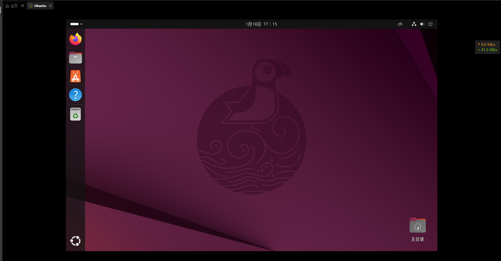
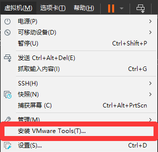
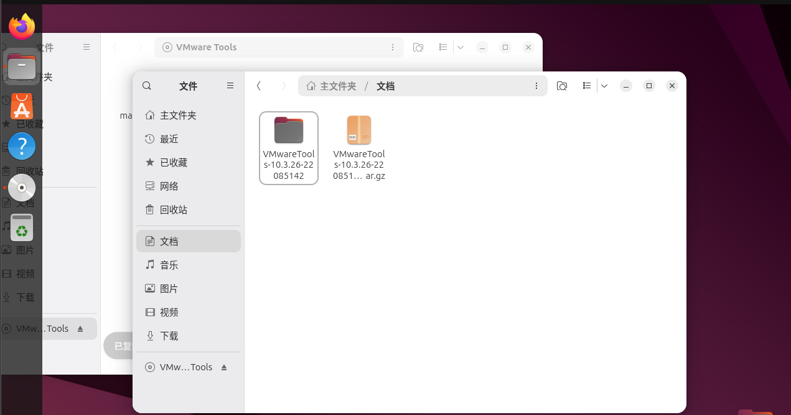
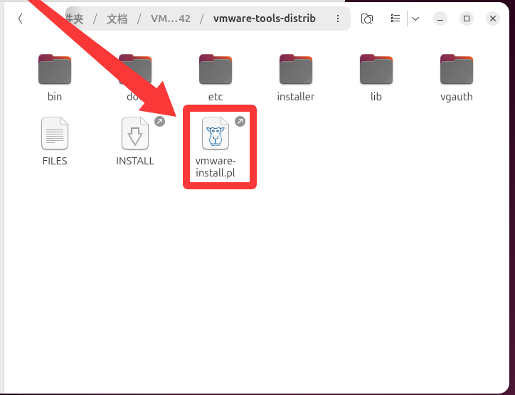

---
title: 如何在Unbantu中安装VMware Tools
published: 2026-01-18
image: ./cover.png
description: 在Unbantu里安装虚拟机工具
tags: [科技, 教程]
category: 教程
draft: false
--- 
# 使用Linux.iso文件安装

## **1.1.启动Unbantu系统**

### **1.2. 在虚拟机选项卡中选择“安装VMware Tools”**

在按下后会自动选择VMware Tools的Linux版本iso文件挂载

虚拟机中就有如下图的图标并且在鼠标停留在该图标上时会有“VMware Tools”字样时，就代表虚拟机直接识别到VMware Tools的iso

#### **1.3.打开后移动到你想放到的文件夹，并双击鼠标左键提取**

例如我将它移动到文档文件夹

##### **1.4.打开提取出来的文件进入"vmare-tools-distrib"**

此时你会看到一个pl文件

直接右击点击“在终端中打开"输入下方命令

    sudo ./vmware-install.pl

在输入你的密码，然后一路回车就行了

# 安装后没有效果如何解决

## **2.1.直接用apt安装**

    sudo apt update
    sudo apt install open-vm-tools open-vm-tools-desktop

这是本人找到最有效的方法了，所有功能都正常.

:spoiler[这B VMware好多文件都不能直接拖进虚拟机]